Komenda docker images
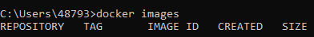

Komenda docker search
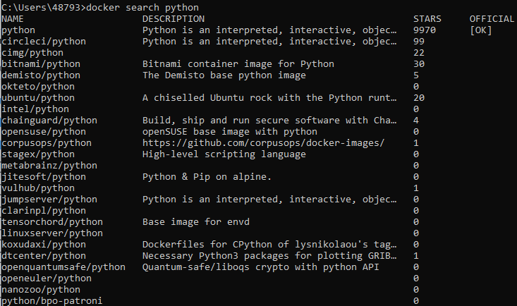

Komenda docker pull (ubuntu 22.04)
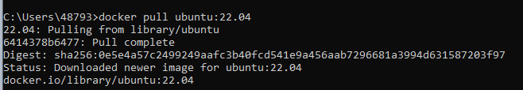

Komenda docker pull (ubuntu 22.10)
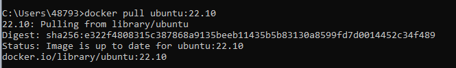

Komenda docker images (po pull)
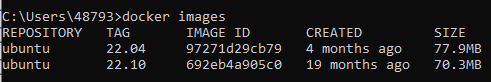

Komenda docker rmi (usuwanie obrazu)
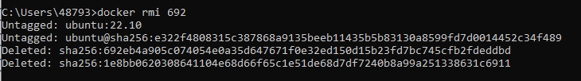

Docker images po usunieciu
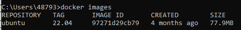

Docker system prune (usuwanie nieuzywanych obrazow)
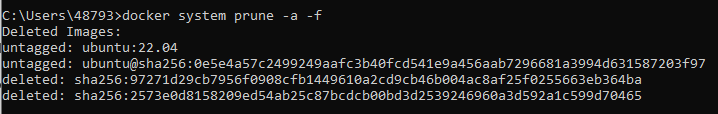

Docker run
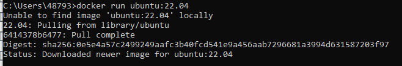

Docker ps
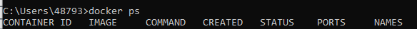

Docker ps -a (pokazuje zatrzymane kontenery)
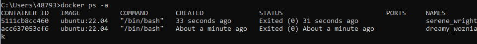

Docker run z nadpisaniem argumentow entrypointu
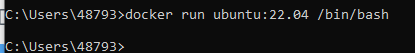

Docker ps -a (ponowny, po poprzedniej komendzie)
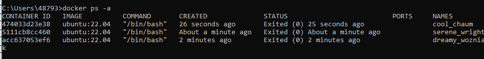

Docker run -it (otwiera sesje terminala)
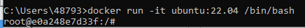

Uruchamianie komend bashowych w kontenerze
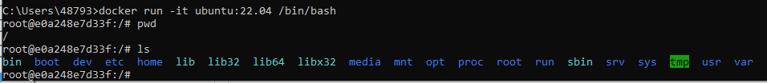

Docker run -d (odpina kontener z aktualnej sesji terminala)
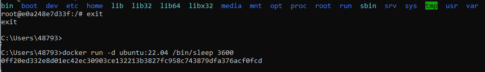

Docker ps
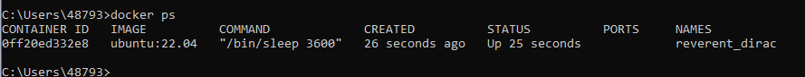

docker exec -it (analogicznie do docker run -it, tylko podczas dzialania kontenera)
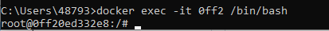

Uruchamianie komendy wewnatrz kontenera przez exec
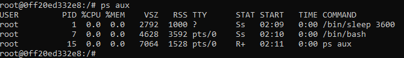

exit i docker ps
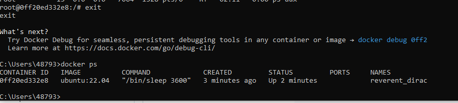

Docker stop
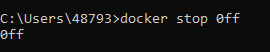

Docker ps -a
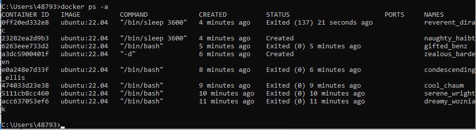