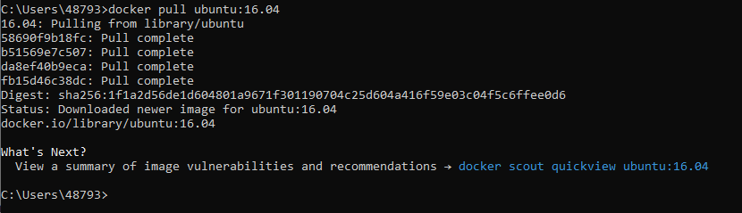
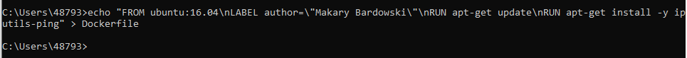
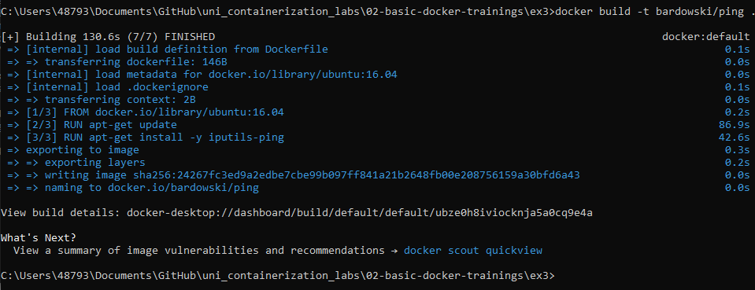
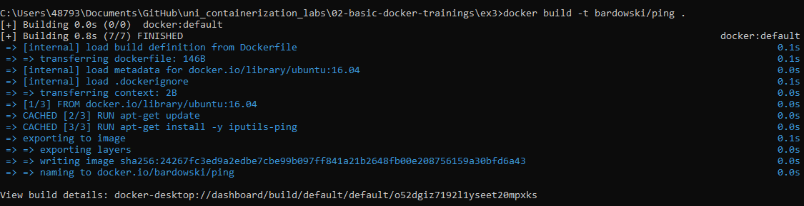
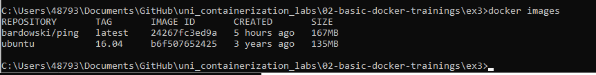
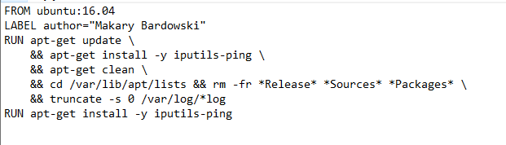
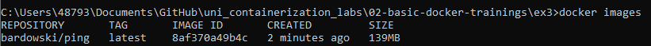

Docker pull ubuntu:16.04

Tworzenie dockerfile

Docker build z tagami

Docker build (mechanizm cachowania)

docker images po build

zopytmalizowany dockerfile

Rozmiar obrazu po optymalizacji
