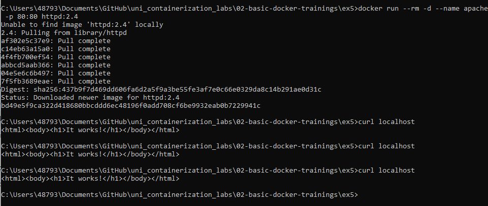
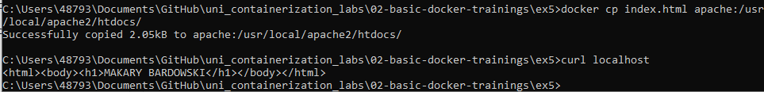
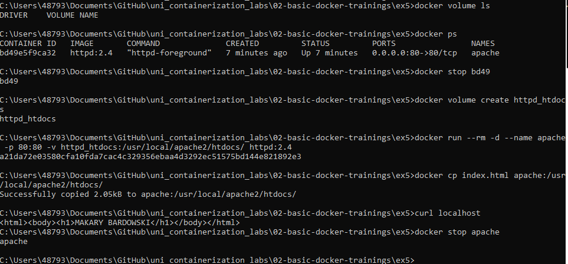
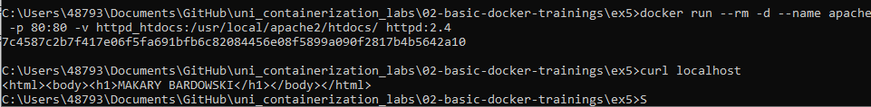

Docker run (z nazwa dla kontenera), mapowanie portów za pomocą flagi -p oraz curl

Kopiowanie pliku index.html i curl zeby potwierdzic zmiany

Listowanie woluminów, tworzenie woluminu oraz ponowne uruchomienie kontenera wraz z ponownym kopiowaniem pliku

potwierdzenie ze dane zostaly zachowane
