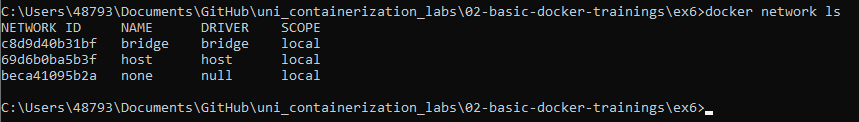
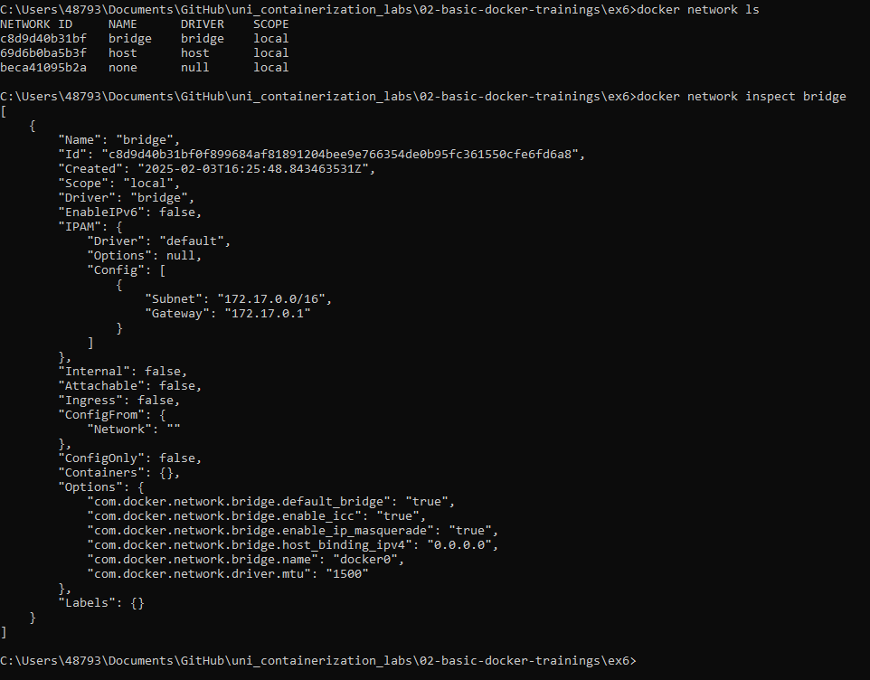
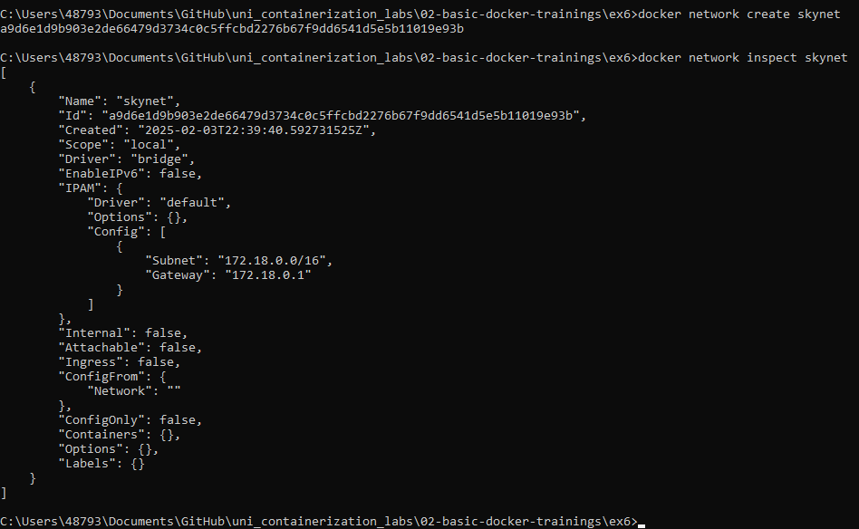
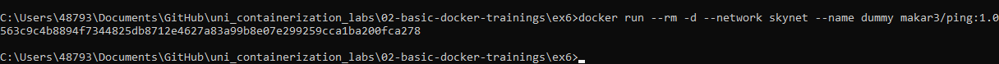

Docker network ls

Docker network inspect domyslnej sieci bridge

Tworzenie nowej sieci przez docker network create

Dołaczanie kontenera do sieci za pomoca opcji --network

mapowanie portów host:kontener 
