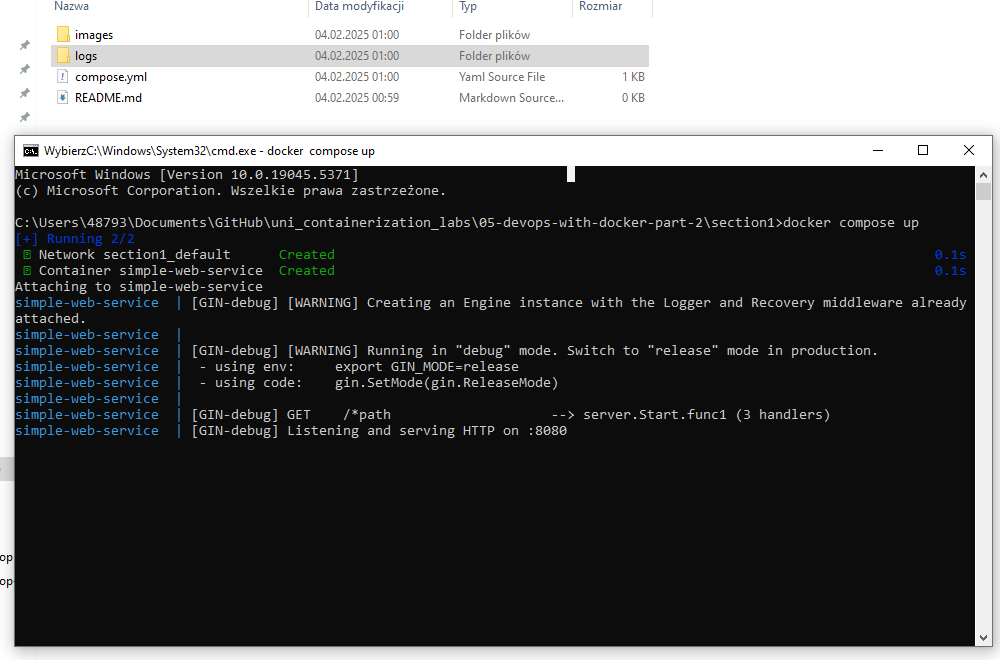

<h4>zadanie 2.2</h4>
uruchomienie zawartego compose.yml (z woluminem dla logow)

<h4>zadanie 2.3</h4>
w zwiazku z problemami technicznymi w poprzednich zadaniach, zadanie wykonano we własnym finalnym projekcie (frontend + backend + BD): [link do repozytorium z projektem](https://github.com/MakaryBardowski/snotify_zaliczenie)
